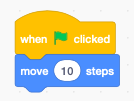
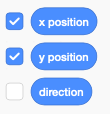
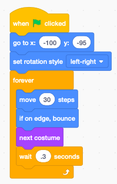

Introduction à Scratch
======================

Scratch est un **langage de programmation** qui utilise des blocs.
Chaque **bloc** est une instruction que l'ordinateur comprend.
Tu mets des blocs ensemble pour créer un **programme**.

Créer un compte
---------------

Pour sauvegarder et partager tes programmes en ligne,
tu dois aller sur le site Scratch et créer un compte.

https://scratch.mit.edu/

* N'utilise pas ton vrai nom pour créer un compte

Choix du langage
----------------

Pour changer la langue de Scratch, cliqure sur le symbole du globe.
Si tu choisis **English** tu obtiendra cette interface:

.. image:: english.png

Pas seulement les menus seront tous traduit dans la nouvelle langue.
Le code lui-même change aussi. 

Par exemple *avance 10 pas* en français va devenir *move 10 steps* en anglais.

Les blocs
---------

Dans l'onglet **Code** tu trouves 9 catégories de blocs. 
Chaque catégorie a une couleur différente.
Ceci te permet de les reconnaitre plus facilement.

Les blocs de la catégorie **Movement** sont bleus. 
Tu peux y trouver par example le bloc *avander de 10 pas*.
Tu y trouves toutes les commandes pour faire bouger un sprite.

Les blocs de la catégorie **Evénements** sont beiges.
Tu peux y trouver par exemple le bloc *quand ⚑ est cliqué*.
Ce type de bloc doit toujours être en haut d'une séquence de blocs.
Tu vois que sa forme est différente: il n'a pas d'encoche de connexion vers le haut.

Pour programmer tu dois déplacer un bloc depuis la palette vers la zone de scripts.
Deus bloc se connectent à l'aide de petits embouts.

Ton premier programme
---------------------

- clique sur **Evénements**
- choisis le bloc *quand ⚑ est cliqué*
- clique sur **Mouvement**
- choisis le bloc *avancer de 10 pas*

Crée ce programme

Lance le programme en faisant une des deux choses:

- cliquer sur le bout de code
- cliquer sur le drapeau vert

ce qui fait anvancer le chat de 10 pas.
En Scratch 1 pas est un pixel.
Un pixel est un point élémentaire de l'écran.

Les coordonnées
---------------

A la fin de la palette **Mouvement**, tu peux cocher *abcisse x* et *ordonnée y*.

Ceci va afficher les coordonnées du sprite dans l'écran.

.. image:: coord_display.png

Essaye de déplacer le chat.

Les coordonnées vont varier de -240 à 240 pour la direction x (abscisse) 
et de -180 à 180 pour la direction y (coordonnée).

Bouger avec les flèches
------------------------

Tu peux utiliser les touches de direction pour déplacer le sprite.
Crée ce bout de programme pour faire avancer le chat de 30 pas
quand tu appuye sur la touche *droite*.

.. image:: move_right.png

Crée un autre bout de programme pour faire reculer le chat de 30 pas
quand tu appuye sur la touche *gauche*.

Bouger dans l'axe y
-------------------

Tu peux faire bouger le chat vers le haut avec ce bout de code:

et vers le bas avec ce code-ci:

Glisser vers une position aléatoire
-----------------------------------

Tu peux facilment faire glisser ton sprite vers une position aléatoire.
Essaie ce-ci:

.. image:: move_random.png

Animer la marche
----------------

L'apparence d'un sprite est appelé **costume**. 
Le chat a déjà un deuxième costume par défaut, avec les pieds dans une autre position.

Le code suivant va créer une animation. 
La position des pieds dans les deux images est différent de 30 pas. 
Si tu change de costume itération, ça donne l'impression que le chat marche.

.. image:: animate1.png

Quand le chat arrive au bord droit, il ne peut plus avancer et reste coincé.

Tu peux ajouter le bloc *rebondir si le bord est atteint*.

Animation d'un sprite
---------------------

Tu peux faire bouger automatiquement un sprite en mettant les blocs de déplacement
de l'exemple précéent dans une boucle.

Quand tu clique sur le drapeau, le chat commence à faire des aller-retours
en continuité.

.. raw:: html

    <iframe src="https://scratch.mit.edu/projects/380796710/embed" allowtransparency="true" width="485" height="402" frameborder="0" scrolling="no" allowfullscreen></iframe>

https://scratch.mit.edu/projects/380796710

