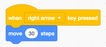
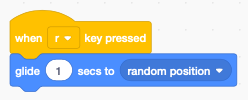

Introduction to Scratch
=======================

Scratch is a **programming language** which uses blocks.
Each **block** is an instruction for the the computer to do something.
To create a **Scratch progam**, you assemble colored blocks into a sequence.

.. raw:: html

    <iframe src="https://scratch.mit.edu/projects/380796710/embed" 
    allowtransparency="true" width="485" height="402" frameborder="0" scrolling="no" allowfullscreen></iframe>

Create an account
-----------------

You can create a Scratch program directly in a web navigator by going to this address

https://scratch.mit.edu/

If you want to save and share your programs you have to create your own account.
Don't use your real name when creating an account.

Switch the language
-------------------

To change the language of the Scratch menus and of the programming blocks, 
click on the globe symbol and select your desired language.

In **English** you get this interface:

In **Japanese** you will get the interface below.
Not only the Scratch menus and tabs are translated to the new language, 
also the language inside the program blocks changes.

For example the block *move 10 steps* in English becomes *10歩動かす* in Japanese.

The programming blocks
----------------------

In the **Code** tab you find 9 different block categories.
Each category has a different color.  The **Motion** blocks are blue.
This category contains all the blocks to move a sprite.
The coloring helps you to recognize the blocks more easily.

The blocks in the **Events** category are yellow. 
You find for example the block *when ⚑ clicked*.
This type of block is called a **hat block** and is used at the top of a progamming stack.
It allows to attach other blocks only below, not above.

.. image:: menu_event.png

To create a program you drag blocks from the palette to the script canvas.
Two or more blocks interlock to form a **stack**.

Your first program
------------------

Create your first program by doing the following: 

- select the **Events** category
- drag the *when ⚑ clicked* block to the canvas
- select the **Motion** category
- drag the *move 10 steps* block to the canvas and attach it

.. image:: intro1.png

You can execute the program either by 

- clicking on the code blocks
- clicking on the green flag

.. image:: cat.png

Executing the code makes the cat move 10 steps forward.
A step is the base unit of the screen (also called a pixel); 
the whole stage is 480 pixels wide.

The coordinate system
---------------------

At the end of the **Motion** palette you can check 

- x position
- y position

.. image:: coord_check.png

This will display the coordinates of the cat on the stage.
In the example below, the cat is at position x=-15 and y=114.

.. image:: coord_display.png

Try now to move the cat with the mouse.

- the x position goes from -240 to 240
- the y position goes from -180 to 180

Move a sprite
-------------

You can use the arrow keys to move the cat sprite to the left or to the right.
Create this code which moves the cat sprite 30 steps when you press the *right arrow* key.

Create another code stack which moves the cat sprite 30 steps to the left, 
when you press the *left arrow* key.

.. image:: move_left.png

Move along the y axis
---------------------

You can also move the sprite up along the y-axis using this

.. image:: move_up.png

or move the sprite down, using that

.. image:: move_down.png

Glide to a random position
--------------------------

There is a block to move the sprite to a random position.
Try this:

Animate walking
---------------

A sprite can have more than one appearance. It's called a **costume**. 
The cat has 2 costumes which are called *costume1* and *costume2*. 
It's feet are in a different walking position. These are the two cat costumes.

By alternating between these two costumes and advancing at the same time,
we get the illusion of walking.

When the cat reaches the right edge, it cannot move any further.

.. image:: cat_border.png

You can add the block **if on edge, bounce** to make the cat go the other way.

Continous animation
-------------------

You can animate a sprite continously by using a loop. 
But now we have to slow it down with a **wait 0.3 seconds** block.

.. image:: animate2.png

When you start the program by clicking on the green flag, 
the cat starts to pace back and forth continously.

Add a backdrop
--------------

You can also add a backdrop to your program.

.. raw:: html

    <iframe src="https://scratch.mit.edu/projects/380796710/embed" 
    allowtransparency="true" width="485" height="402" frameborder="0" scrolling="no" allowfullscreen></iframe>

https://scratch.mit.edu/projects/380796710

