Techniques
==========

This section shows useful programming techniques.

Click on blocks to execute 
--------------------------

You can click on blocks in the palette and on blocks on the canvas and execute these blocks.
For exemple you can click on these **move** and **turn** blocks to test them quickly.
This is very useful to understand which processes are currently running.

.. image:: block1.png

Running block is yellow
-----------------------

When your block is running, it has a yellow outline.
You can start the **forever** block by clicking on it.
When you click a second time, it stops.

.. image:: block2.png

Stacked blocks
--------------

You can stack blocks to create program sequences (or stacks). 
Clicking on any of the blocks, will execute the whole stack.

.. image:: block3.png

Capitalize sprite names
-----------------------

Capitalize sprite names. They are classes from which you can clone objects.

.. image:: sprite1.png

Sprites have variables
----------------------

Sprites have built-in variables, which describe their state.
You can visualize these **reporter** blocks by clicking on their check box.

.. image:: var1.png

This makes the values be displayed on the stage.

.. image:: var2.png

Click on reporters
------------------

Click on a reporter block to display it's value.

.. image:: var3.png

Sprite variables
----------------

Each sprite (and clone) has these variables:

- position (x, y)
- visible
- size
- direction

.. image:: sprite2.png

Toggle sprite size
------------------

When toggling a value, you need a variable to store the current state. 
You can use existing variables. In the following example the size variable is used to toggle.

.. image:: size1.png

Change size by
--------------

We can show the effect of the **change size by** block
by applying it in a loop on multiple clones of the cat.

.. image:: size2.png

Inside the loop we:

- create a clone
- move by 80 points
- change the size by 10

The first 4 cats are clones, the last one is the orignal.

.. image:: size3.png

Increment a variable
--------------------

The block **change by** can be used to increment a variable.
The exemple below increments the variable **i** by 1 when pressing space.

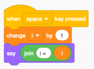

We display the variable in a speech bubble.

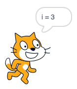

Reset the counter
-----------------

Each time we press the space bar the counter **i** increments.
We can add an **if** block to reset the counter when reaching a certain value.

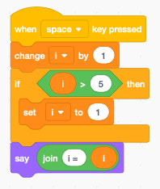

Use modulo to wrap
------------------

Another way to wrap around is the function **modulo** or **mod** which returns
the remainder of a division.

This is shorter:

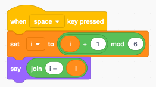

How does it work ? 
You can place only the **mod** block on the programming canvas and test it
by entering numbers and click with the mouse to evaluate the expression.

You will see **5 mod 6** is 5 (the reminder of 5 divided by 6).

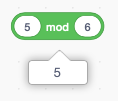

You will see **6 mod 6** is 0 (the reminder of 6 divided by 6).

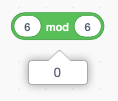

The counter i cycles through the 6 values 0, 1, 2, 3, 4, 5.

To start with 1 instead with 0 we can modifiy the expression to this.

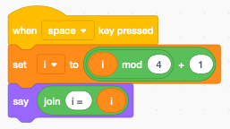

The counter i cycles now through the 4 values 1, 2, 3, 4.

Cycle the other way
-------------------

We can also decrement and cycle back when reaching 0.

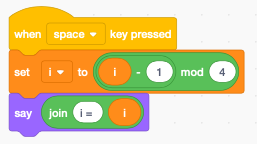

Here the counter **i** cycles through the range 3, 2, 1, 0.

Timing
------

Sometimes we need to know how long it takes to execute a piece of code.
We can use the **timer** block for this. To measure the time we use the variable **t**.

- Start: memorize the start time in **t**
- End: substract the start time **t** from the current time

The animation loop
^^^^^^^^^^^^^^^^^^

Loops in Scratch are slowed down to allow simple animation.
Let's measure the time to repeat a **move** block 10 times.
The total time is 0.32 seconds. 
Thus the loop time is 32 ms which results roughly in 30 frames per second.

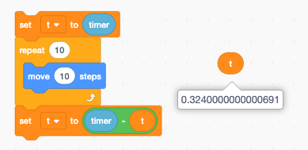

Empty loop
^^^^^^^^^^

How long does it take to repeat an empty loop 10 times?
The time is too small to be measured. Even if we increase to 1000 times, the measured time still shows 0.
We need to repeat the loop 1 million times, to be abe to measure something. It takes a total time of 1.2 seconds.
Thus executing the empty loop takes only 1.2 us.

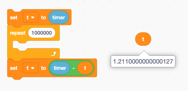

Simple assignment
^^^^^^^^^^^^^^^^^

When adding a **set to** block the time increases to 2 us.
We conclude that the **set to** block alone takes 0.8 us. 

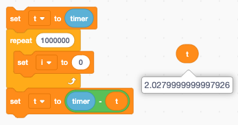

The **change by** block takes the same amount of time, roughly 0.8 us.

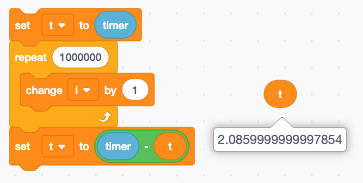

Math operation
^^^^^^^^^^^^^^

When putting the **add** block inside the **set to** block the loop execution time becomes 3 us.
Thus we conclude the **add** block takes 1 us.

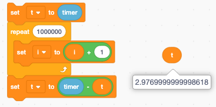

String operation
^^^^^^^^^^^^^^^^

A simple string operation takes roughly the same time as a math operation.
Accessing an indexed letter in a string takes 1.2 us.

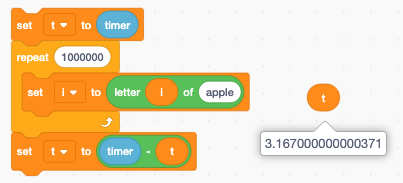

The **join** block however needs to copy strings. As the strings get longer, this operation takes more and more time.
We decrease the repetition count to 100'000.
In this task we add the letter 'x' to the string variable.
The string length varies from 1 to 100'000. The average string length is 50'000. 
The average **join** operation takes now 8 us. 

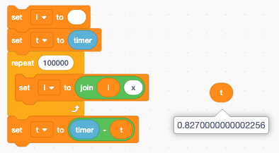

Resolution of the timer
^^^^^^^^^^^^^^^^^^^^^^^

What is the resolution of the timer? 
Does it have micro-second resolution?

In fact now. The Scratch **timer** is a VERY low resolution timer.
To measure its resolution, we record all timer values in a list.

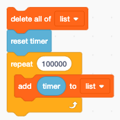

When recording 100'000 times values we get the following values:

- 0
- 0.054
- 0.101
- 0.139
- 0.184
- 0.227
- 0.263
- 0.3

The increments are 54, 47, 38, 45, 43, 36, 37 ms.
This is a very crude timer, and we have to take this into account when we make measurements.

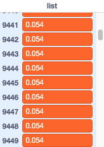

Broadcast messages
-------------------

Sending messages allows to start arbitrary pieces of code. 
If there are multiple receivers, they apperantly all start at the same time.
In reality, however, control is rapidly being swiching between the different processes. 

Simultaneous receivers
^^^^^^^^^^^^^^^^^^^^^^

Here we see the broadcast of **message 1** which has already ended, and the 2 receiving blocks which are still active. 

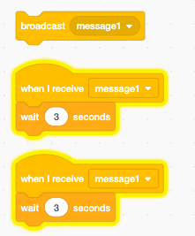

Broadcast and wait
^^^^^^^^^^^^^^^^^^

The **broadcast and wait** block waits until the last message has been finished.
Here we see the first stack finished and the second stack still being executed.

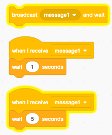

Multi-threading
^^^^^^^^^^^^^^^

How does it work when two stacks execute simultaneously ?
Let's try to understand what happens. We will create a **msg** list, where each process makes an entry when it executes.
Both processes (1 and 2) run concurrently and execute a loop 1000 times.

The entry is: 

- process number (1 or 2)
- timer

At the start the timer is reset.

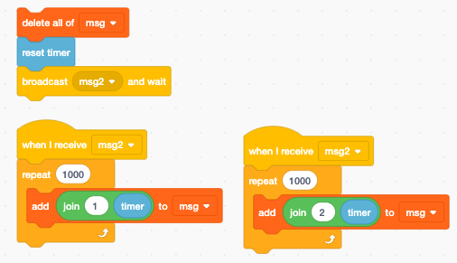

The result is that for each of the 1000 iterations the 2 processes alternate. 
Each one gets a turn during each iteration.

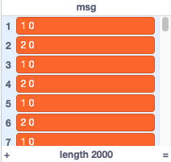

Wait inside a thread
^^^^^^^^^^^^^^^^^^^^

What happens when we introduce an extra wait in one of the processes ?
Let's say we introduce a 1 ms wait in process 1. 
Will process 2 get more time to run ?

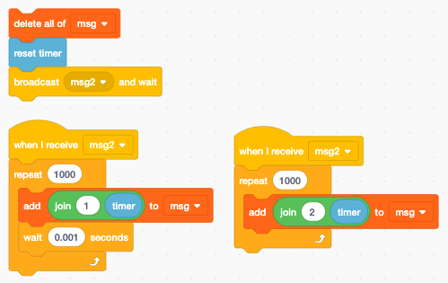

The result is quit curious.
Process 1 and process 2 still alternate, but now process 2 get's a second chance to run during the wait time of process 1.
The overall result is that process 2 runs twice as often as process 1. 

The wait block has a 1 ms wait time, but in reality the waiting is aligned with the 33 ms internal screen refresh timer.

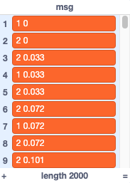

The two processess alternate until index 1500, at that time process 2 has done the 1000 iterations and terminates.
Process 1 continues for another 1000 iteration roughly every 33 ms. 
The total time is 33 seconds.

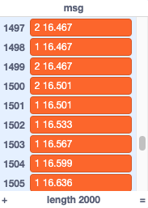

Execution order
^^^^^^^^^^^^^^^

In what order are the processes executed ?
A little bit of experimentation shows the processes are executed in their order of creation.
This order cannot be changed. Copy-paste a previous process creates a new one at the last position.

Each process adds it's process number to the variable **seq**.
We see 

- process 1 and 2, which are in the same sprite 
- process 3 in a different sprite
- process 4 in the stage

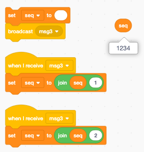

..
    Timing
    ------
    how to time the duration

    Messages
    --------
    What order are they called ?
    when they are on the same sprite, different sprite
    what happens when a stack is alread running ?

