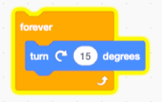

Techniques
==========

This section shows useful programming techniques.

Click on blocks to execute 
--------------------------

You can click on blocks in the palette and on blocks on the canvas and execute these blocks.
For exemple you could click on these **move** and **turn** blocks to test them.

Running block is yellow
-----------------------

When your block is running, it has a yellow outline.
You can start the **forever** block by clicking on it.
When you click a second time, it stops.

Stack blocks
------------

You can stack blocks. Clicking on any of the blocks, will execute the whole stack.

.. image:: block3.png

Capitalize sprite names
-----------------------

Capitalize sprite names. They are classes from which you can clone objects.

Sprites have variables
----------------------

Sprites have built-in variables, which describe their state.
You can visualize these **reporters** by checking them.

.. image:: var1.png

This makes the values be displayed on the stage.

Click on reporters
------------------

Click on a reporter block to display it's value.

.. image:: var3.png

Sprite variables
----------------

Each sprite (and clone) has these variables:

- position (x, y)
- visible
- size
- direction

Toggle size
-----------

When toggling a value, you need a variable to store the current state. 
You can use existing variables. In the following example the size variable is used to toggle.

.. image:: size1.png

Change size by
--------------

We can show the effect of the **change size by** block
by applying it in a loop on multiple clones of the cat.

Inside the loop we:

- create a clone
- move by 80 points
- change the size by 10

The first 4 cats are clones, the last one is the orignal.

.. image:: size3.png