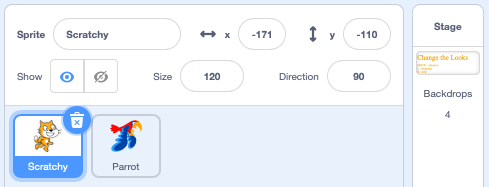

Looks
=====

In this section we focus on how the graphical elements (sprites) look and 
 how you can modify their look.

Sprites
-------

Sprites are the graphical objects which you place into the stage.

They have a 

- name (Scratchy)
- position (x=-171, y=-110)
- visbility (show)
- size (120%)
- direction (90°)

Backdrops
---------

Backdrops are like sprites, but they are fix in size and cannot be repositioned.

As bitmaps they have the size 360 x 480 pixels.
However in the editor there is twice the pixel density.
In full-screen mode you can see the pixels.

Changing looks
--------------

.. raw:: html

    <iframe src="https://scratch.mit.edu/projects/395424129/embed"
     allowtransparency="true" width="485" height="402" frameborder="0" scrolling="no" allowfullscreen></iframe>

https://scratch.mit.edu/projects/395424129
    
Draw a spiral
-------------

.. raw:: html

    <iframe src="https://scratch.mit.edu/projects/380856624/embed" allowtransparency="true" width="485" height="402" frameborder="0" scrolling="no" allowfullscreen></iframe>