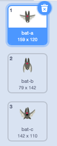
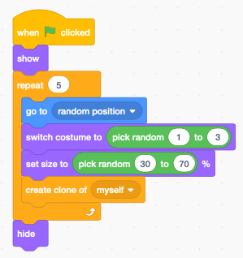
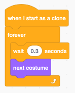
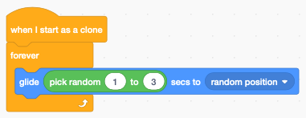
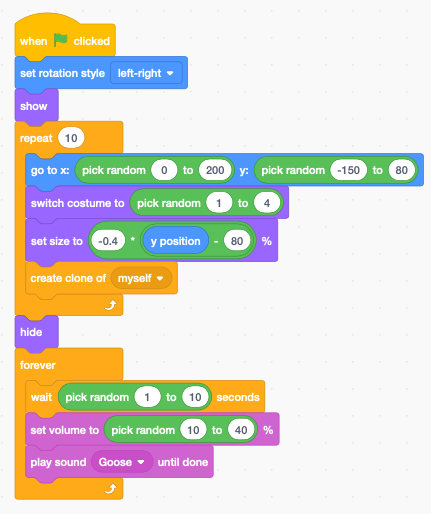

Animation
=========

With Scratch you can easily animate sprites.
Many sprites already have multiple costume. 
You can give the impression of walking or flying by simply alternating between
two different costumes.

Flying sprites
--------------

.. raw:: html

    <iframe src="https://scratch.mit.edu/projects/391871367/embed" 
    allowtransparency="true" width="485" height="402" frameborder="0" scrolling="no" allowfullscreen></iframe>
    
https://scratch.mit.edu/projects/391871367

The **Bat** sprite has 4 costumes. You can delete the 4th one (sleeping) and just keep
the 3 flying costumes.

Want multiple bats in the sky. Therefore we are going to make clones.
Note that we do not anymate the original. 
We only use it to make clones. At the end we hide the original.

Inside I loop we

- go to a random position
- choose a randome size
- choose a random costume
- make a clone

In order to give the impresion to fly, we change the costume every 0.3 seconds.

To move the bats around on the screen, we let them glide to random positions, 
every 1-3 seconds.

Moving chickens
---------------

The following example shows how to animate chickens.

.. raw:: html

    <iframe src="https://scratch.mit.edu/projects/395241257/embed"
     allowtransparency="true" width="485" height="402" frameborder="0" scrolling="no" allowfullscreen></iframe>

https://scratch.mit.edu/projects/395241257

At the start we set the rotation style to **left-right** 
because we do not want the hens to be upside down.

Inside the loop we:

- go to a random position (avoding the cabbin and the far back)
- switch to a random costume
- set a size which depends on y
- create a clone

For each cloned hen we do this in a loop:

- switch to the next costume
- wait 1-2 seconds
- randomly move to the left or to the right
- randomly point to the left or to the right

Animate fisch
-------------

.. raw:: html

    <iframe src="https://scratch.mit.edu/projects/395268942/embed" 
    allowtransparency="true" width="485" height="402" frameborder="0" scrolling="no" allowfullscreen></iframe>

https://scratch.mit.edu/projects/395268942