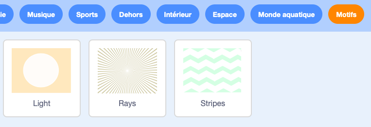
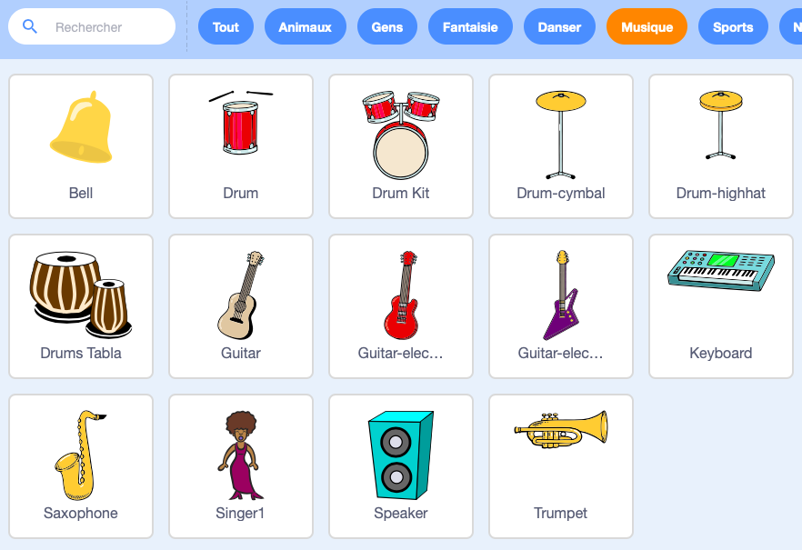
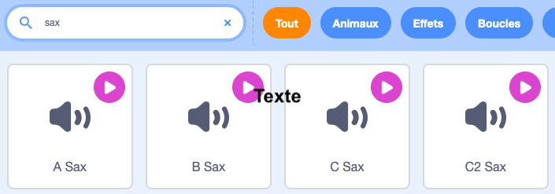

Animation
=========

.. raw:: html

    <iframe src="https://scratch.mit.edu/projects/380951396/embed" 
    allowtransparency="true" width="485" height="402" frameborder="0" 
    scrolling="no" allowfullscreen></iframe>

Music
-----

Choisi un arrière-fond neutre dans la catégorie **Motifs**. 

Fais une recherche pour nouveau sprite dans la catégorie **Musique**. 
Sélectionne le saxophone. 

Clique sur le saxophone et va vers l'onglet **Sons**.
Tu peux effacer le sons déjà existant et importer les sons **sax**:

