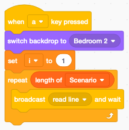

Animation
=========

With Scratch you can easily animate sprites.
Many sprites already have multiple costume. 
You can give the impression of walking or flying by simply alternating between
two different costumes.

Flying sprites
--------------

.. raw:: html

    <iframe src="https://scratch.mit.edu/projects/391871367/embed" 
    allowtransparency="true" width="485" height="402" frameborder="0" scrolling="no" allowfullscreen></iframe>
    
https://scratch.mit.edu/projects/391871367

The **Bat** sprite has 4 costumes. You can delete the 4th one (sleeping) and just keep
the 3 flying costumes.

.. image:: bat_costume.png

Want multiple bats in the sky. Therefore we are going to make clones.
Note that we do not anymate the original. 
We only use it to make clones. At the end we hide the original.

Inside I loop we

- go to a random position
- choose a randome size
- choose a random costume
- make a clone

In order to give the impresion to fly, we change the costume every 0.3 seconds.

To move the bats around on the screen, we let them glide to random positions, 
every 1-3 seconds.

.. image:: bat_glide.png

Moving chickens
---------------

The following example shows how to animate chickens.

.. raw:: html

    <iframe src="https://scratch.mit.edu/projects/395241257/embed"
     allowtransparency="true" width="485" height="402" frameborder="0" scrolling="no" allowfullscreen></iframe>

https://scratch.mit.edu/projects/395241257

At the start we set the rotation style to **left-right** 
because we do not want the hens to be upside down.

Inside the loop we:

- go to a random position (avoding the cabbin and the far back)
- switch to a random costume
- set a size which depends on y
- create a clone

For each cloned hen we do this in a loop:

- switch to the next costume
- wait 1-2 seconds
- randomly move to the left or to the right
- randomly point to the left or to the right

Animate fish
------------

.. raw:: html

    <iframe src="https://scratch.mit.edu/projects/395268942/embed" 
    allowtransparency="true" width="485" height="402" frameborder="0" scrolling="no" allowfullscreen></iframe>

https://scratch.mit.edu/projects/395268942

Animate a play
--------------

Wouldn't it be interesting to use Scratch to create a theater play.
Let's take the first scene from **Alice in Wonderland** from the Gutenberg project.

https://www.gutenberg.org/files/35688/35688-h/35688-h.htm

Scene 1 : Alice's home
----------------------

.. literalinclude:: alice.txt

Scenario
--------

The most important point here is to work with lists. 
We have two main lists: 

- Scenario
- Actors

Fortunately we can import and export lists. 
Let's prepare the dialog in a text editor.

- remove the emply lines
- break dialog into lines of less then 128 characters (which is the limit for text-to-speech)
- place the actor's name on a single line
- followed by one more multiple lines of dialog for that actor

.. image:: alice_scenario.png

So far we have 3 actors:

- Alice
- Carroll
- Red Queen

We use Capitalized names.
These names will also figure in the **Actors** list.

Only sprites can show text. 
We use the broadcast message **read line** to 

- set the voice for that actor
- show the dialog text in a bubble
- pronounce it with text-to-speach
- turn off the speech bubble

At the start we 

- set the language to English.
- set the index to 1
- set the actor to empty
- switch to the title background

To read a single line, we load the current **Scenario** line into the variable **line**.
If the line contains exactly the name of an actor in the **Actors** list, 
we set the **actor** variable and proceed.

Otherwise we translate the line of dialog and send the **speak line** broadcast.

Pressing the SPACE bar will perform just the current line of dialog.

Pressing A (All) will perform the whole play from the beginning to the end.

.. raw:: html

    <iframe src="https://scratch.mit.edu/projects/391344110/embed" 
    allowtransparency="true" width="485" height="402" frameborder="0" scrolling="no" allowfullscreen></iframe>

https://scratch.mit.edu/projects/391344110
