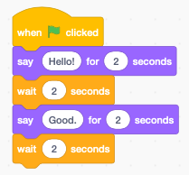
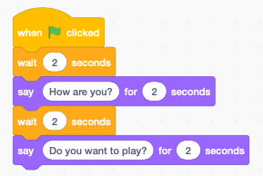
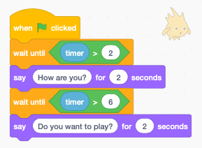
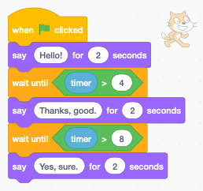
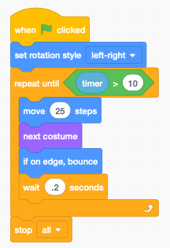
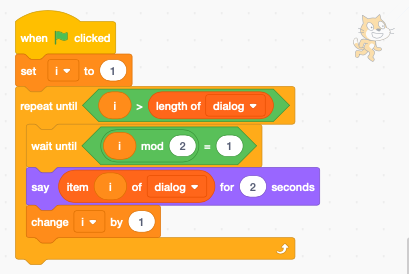
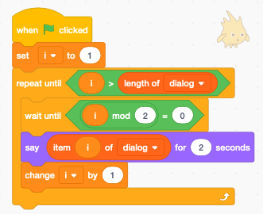
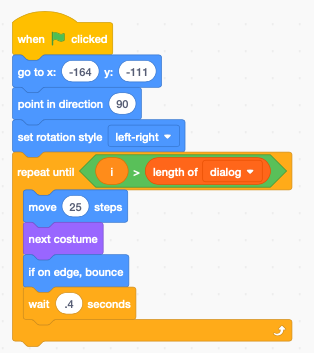

Dialog
======

.. raw:: html

    <iframe src="https://scratch.mit.edu/projects/381954573/embed" 
    allowtransparency="true" width="485" height="402" frameborder="0" scrolling="no" allowfullscreen></iframe>

https://scratch.mit.edu/projects/381954573

Use simple wait blocks
----------------------

The simplest way to make a dialog between two sprites, is to use wait blocks.
Here we have Scratchy the cat and Gobo the blowfish talk to each other.

Each sprite needs to respect the other sprite's timing.

Use the timer
-------------

.. raw:: html

    <iframe src="https://scratch.mit.edu/projects/390653673/embed" 
    allowtransparency="true" width="485" height="402" frameborder="0" scrolling="no" allowfullscreen></iframe>

https://scratch.mit.edu/projects/390653673

A much better way is to use the timer.
Each Scratch project has a timer. When the program starts, the timer starts incrementing.
It is possible to reset the timer. Here we use the timer to know the onset of a new part of dialog.

The Scratchy starts talking at 0, 4, and 8 seconds.

Gobo starts talking at 2 and 6 seconds.

Simultaneously the sprite can do an activity, such as walking.
Here the Scratchy paces from left to write from 0 to 10 seconds.

Use a list for dialog
---------------------

If you have a lot of dialog, it's best to use a list.

.. raw:: html

    <iframe src="https://scratch.mit.edu/projects/390664649/embed" 
    allowtransparency="true" width="485" height="402" frameborder="0" scrolling="no" allowfullscreen></iframe>

https://scratch.mit.edu/projects/390664649

It's easy to change the dialog. Just change the list items.

To start with, you need to create 

- a list **dialog** to contain the dialog items
- a variable **i** to be used as list index

We iterate until the list index **i** is larger than the list length.

The **mod** operator returns the rest of the division by 2.

- **i mod 2 = 1** means i is **odd**
- **i mod 2 = 0** means i is **even**

For Scratchy we wait until the list index **i** is odd.

For Gobo we wait until the list index **i** is even.

Again, we make Scratchy walk, while he is talking.
This time we set the inital position and the initial direction.

