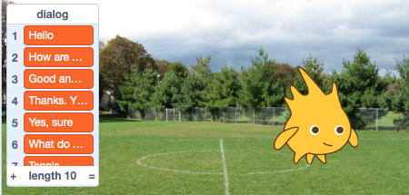

Dialog
======

.. raw:: html

    <iframe src="https://scratch.mit.edu/projects/381954573/embed" 
    allowtransparency="true" width="485" height="402" frameborder="0" scrolling="no" allowfullscreen></iframe>

https://scratch.mit.edu/projects/381954573

Use simple wait blocks
----------------------

The simplest way to make a dialog between two sprites, is to use wait blocks.
Here we have Scratchy the cat and Gobo the blowfish talk to each other.

Each sprite needs to respect the other sprite's timing.

.. image:: dialog1b.png

Use the timer
-------------

.. raw:: html

    <iframe src="https://scratch.mit.edu/projects/390653673/embed" 
    allowtransparency="true" width="485" height="402" frameborder="0" scrolling="no" allowfullscreen></iframe>

https://scratch.mit.edu/projects/390653673

A much better way is to use the timer.
Each Scratch project has a timer. When the program starts, the timer starts incrementing.
It is possible to reset the timer. Here we use the timer to know the onset of a new part of dialog.

The Scratchy starts talking at 0, 4, and 8 seconds.

Gobo starts talking at 2 and 6 seconds.

.. image:: dialog2b.png

Simultaneously the sprite can do an activity, such as walking.
Here the Scratchy paces from left to write from 0 to 10 seconds.

.. image:: dialog2c.png

Use a list for dialog
---------------------

If you have a lot of dialog, it's best to use a list.

.. raw:: html

    <iframe src="https://scratch.mit.edu/projects/390664649/embed" 
    allowtransparency="true" width="485" height="402" frameborder="0" scrolling="no" allowfullscreen></iframe>

https://scratch.mit.edu/projects/390664649

It's easy to change the dialog. Just change the list items.

To start with, you need to create 

- a list **dialog** to contain the dialog items
- a variable **i** to be used as list index

We iterate until the list index **i** is larger than the list length.

The **mod** operator returns the rest of the division by 2.

- **i mod 2 = 1** means i is **odd**
- **i mod 2 = 0** means i is **even**

For Scratchy we wait until the list index **i** is odd.

.. image:: dialog3.png

For Gobo we wait until the list index **i** is even.

Again, we make Scratchy walk, while he is talking.
This time we set the inital position and the initial direction.

Spoken dialog
-------------

In the bottom of the block palette, click the extensions button and select the **Text to Speech** extension.

.. raw:: html

    <iframe src="https://scratch.mit.edu/projects/390682479/embed" 
    allowtransparency="true" width="485" height="402" frameborder="0" scrolling="no" allowfullscreen></iframe>

https://scratch.mit.edu/projects/390682479

Now you can have the sprites pronounce the dialog.

We give a **tenor** voice to Gobo.
The duration of the speech is now dermining the display of the bubble.
To turn off the bubble, you have to say an empty text.

    .. image:: dialog4.png

Scratchy is using an **squeaky** voice.

    .. image:: dialog4b.png

Add mouth movement
------------------

Gobo has 3 costumes with different mouth positions

- gobo-a : closed
- gobo-b : half-open
- gobo-c : open

Since they have a discussion about tennis, we add a sports ground as a back drop.

.. raw:: html

    <iframe src="https://scratch.mit.edu/projects/390691994/embed" 
    allowtransparency="true" width="485" height="402" frameborder="0" scrolling="no" allowfullscreen></iframe>

https://scratch.mit.edu/projects/390691994

Inside the code for speaking we add a block to close the mouth after speaking.

We add a second stack, which is active during the time the index **i** is even.
It cycles through the costumes every 0.2 second.

Enter the dialog
----------------

To enter the dialog into the list, you have the make the list visible on the stage.
Check the box next to the list reporter in the palette.

Now you can

- modify
- add
- delete 

dialog items in the **dialog** list.

