Menu
====

In this section we handle 

- backdrops
- buttons
- background music

.. raw:: html

    <iframe src="https://scratch.mit.edu/projects/391162659/embed" 
    allowtransparency="true" width="485" height="402" frameborder="0" scrolling="no" allowfullscreen></iframe>

https://scratch.mit.edu/projects/391162659

Backdrops
---------

For this project we select two backdrops

- *Forest* for the **home** screen
- *Savanna* for the **play** screen

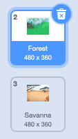

The home screen has a play button.
The play screen has a home button.

The home screen
---------------

When the program starts we

- switch to the *Forest* background
- show the *Play* button

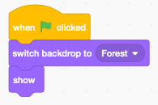

We could add more buttons for options, high-score, etc.

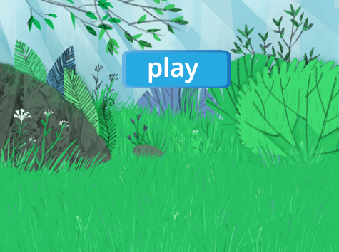

The play button
---------------

When the play button is clicked we

- play a pop sound
- set the boolean variable *music* to zero (to stop the music loop)
- stop all sounds
- broadcast the message *play*
- hide the *play* button

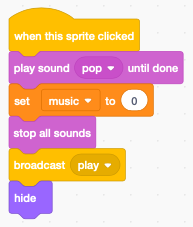

When the play button receives the *home* message it

- waits 0.1 seconds (to be sure the old music stops)
- switch to the *home* background to *Forest* 
- show the button

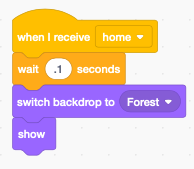

The play screen
---------------

The play screen has a home button and a player (Scratchy).

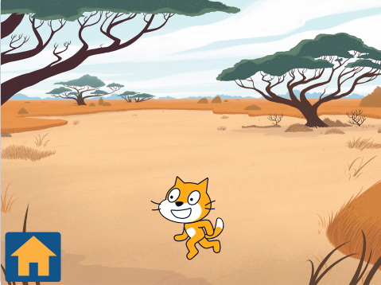

The home button
---------------

The program always starts with the **home** screen,
so initially the home button is hidden.

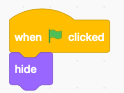

When the *home* clicked is clicked it stops the current music and broadcasts the *home* message.

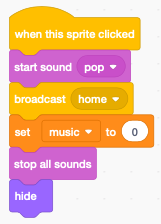

When it receives the *play* message it shows play screen and home button.

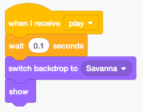

Background music
----------------

The background music is associated with the stage. We choose:

- *Bossa Nova* for the home screen
- *Video Game 1* for the play screen

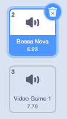

When the backdrop switches, a new music is played

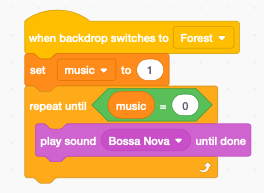

- the boolean variable **music** is set to 1
- the sound is repeated until the boolean **music** is reset to 0

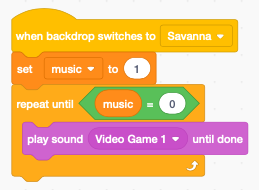

