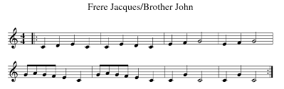
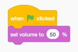

Music
=====

With Scratch you can play music.

.. raw:: html

    <iframe src="https://scratch.mit.edu/projects/395043889/embed" 
    allowtransparency="true" width="485" height="402" frameborder="0" scrolling="no" allowfullscreen></iframe>

https://scratch.mit.edu/projects/395043889

You can play music in Scratch, but you have to load the extension **Music**.
This will add the following new blocks:

Play a melody
-------------

Lets play the music French folk song **Brother John**.

During the first measure we have 4 quarter notes.

- C (60)
- D (62)
- E (64)
- C (60)

Select the block **play note** and select the note C (60) 
on the pop-up keyboard which appears. You can leave the duration at 0.25 beats.

The same 4 notes repeat for a second measure. We can use a loop to repeat.

Change the tempo
----------------

The original tempo is 60 bpm (beats per minute).
Let's add a way to change the tempo with the up/down keys.

Change the instrument
---------------------

The default instrument is a piano (1).
The block **set instrument to** allows to chose among 21 different instruments.

Create a variable called **instrument**.
Let's add a way to change the instrument with the left/right keys.

Set the volume
--------------

The volume can be set separately for each sprite.
For example the keyboard can have the volume at 30%, 
while the saxophone has the volume at 100%.

At the start we set the volume to 50%.

We use the two C/V buttons to set the volume.

Play a drum
-----------

The block **play drum** allows to play one of 18 different drums.

We can combine 4 quarter beats in a loop and repeat 16 times.

This creates a base rythm for our music.

Play a Jazz classic
-------------------

Together with the percussion, we can play a saxophone melody.
The melody has a length of 16 measures and 
is the beginning of **Autumn leaves**, a jazz classic.

We use the **automn leaves** message to start the melody
and the percussion at the same time.

We can start the music when clicking the saxophone sprite.

We can also start when pressing the A key.

Use a list for the score
------------------------

A more flexible way to enter the music is to use a list.
Let's see how we can encode the following music score of 
**Hedwig's Theme** in a list.

First we send the message **hedwigs theme** when
the guitar sprite is clicked or the H key is pressed.

The notes and duration of the score is kept in a list **hedwig**.

- odd indexes contain a note
- even indexes contain a duration

The total lenght of the list is 62.

We can play the list and access each successive note and duration 
with an index pointer **i**. 

- the i-th elemetn of the list is a note
- the i+1-th element is the duration

To avoid decimal fractions we multiply the duration by 8.
That means a duration of 0.125 beats is encoded as 1
A duration of 0.25 as 2 and 0.5 as 4.

With this music as well, we add a little percussion loop.

