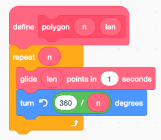
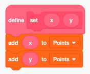
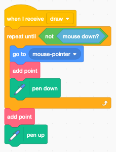

Pen
===

The pen extension is a drawing module.
It adds 9 dark green blocks.

.. image:: pen_blocks.png

The pencil sprite
-----------------

We are going to use the **Pencil** sprite. 
In order to make the line appear at the point of the pencil, 
you must go to the sprite editor, select the whole drawing (cmd+A) 
and place the tip of the pencil at the origin marker.

Draw a line
-----------

Now we can place the pencil somewhere on the stage and draw a line.
To do so we:

- erase all
- set the pen color (red)
- set the pen size (3 points)
- put the pen down
- move 100 steps

This is the result, drawn on the backdrop with xy axes.

RGB colors
----------

The **set pen color to ()** block has a drop-down menu to select the color via:

- color
- saturation
- brightness

It is also possible to provide the color with an integer variable.
Most computers represent color with the 3 components:

- red
- green
- blue

This is also called the **RGB color** system.
The three components are expressed with a byte-sized value.
The intensity of each color component can go from 0 to 255.

Each color component occupies one byte and the 3 components can be combined into a 3-byte integer.
When expressed as hexadecimal digit, the RGB color number has this format::

    0xRRGGBB

For example:

- ``0xFF0000`` is red
- ``0x00FF00`` is green
- ``0x0000FF`` is blue

We use 3 variables and express each base color at maximum intensity.

Now we can used these variables to draw three line segments in these base colors.
- blue is 255
- green is 255 shifted by 8 bits (multiplied by 256)
- red is 255 shifted by 16 bits (multiplied by 256*256)

This is the result:

We can also add two base colors to get a new color.

- red and green = yellow
- red and blue = magenta
- blue and gren = cyan

This is the result:

Move slowly
-----------

The **Motion** category has a **glide to x, y** block.
We can create a similar block for gliding a certain distance.

In Scratch a loop executes 25 times each second.
To last **t** seconds, it must repeat ``t*25`` times.

The distance increment of each iteration is ``1/(t*25)`` of the total distance.

To test the gliding move we write:

Draw a square
-------------

Now we combine the slow move and the slow turn block to draw a square.

This is the result.

If we do not set the rotation style, the pen will turn by 90 degrees at each corner.
That does not give a natural animation style. It's better to not rotate the pen.
Therefore at the start we set the rotation style to **don't rotate**.

.. image:: pen_rotation.png

Draw a polygon
--------------

We can turn this into a function **polygon** which can draw any arbitrary regular polygon.

This is the code to test for a hexagon.

This is the result drawn to the stage.

Draw a star
-----------

There is a simple algorithm to draw a star. 
It's almost like a polygon, but it has an extra parameter **m**.

- n : the number of points
- m : the number of points to jump over

This is the result for a **(7, 3)** star which is a 7-pointed star, 
jumping always to the 3rd point.

Here is the code:

.. raw:: html

    <iframe src="https://scratch.mit.edu/projects/397107138/embed" 
    allowtransparency="true" width="485" height="402" frameborder="0" scrolling="no" allowfullscreen></iframe>

https://scratch.mit.edu/projects/397107138 

Store points in a list
----------------------

In the following section we look at a technique to store points in a list.
For this we need to define 3 variables:

- **x, y** the 2D coordinates
- **i** an integer index which points to the current point in the list

Then we create a list called **Points**. 
This list contains the coordinates of all the points of the shape.

The image below shows the **Points** list with the points (0, 0), (100, 0) and (100, -50).
They represent a rectangular triangle. The first point is repeated at the end to close the shape.

We define a fonction **set x, y** to add the point (x, y) to the **Points** list.

The function **Triangle** sets the 4 points of the triangle shown above.

Load and store
--------------

Operations are executed using two variables **x** and **y**.
At any time, the index variable **i** points at a pair of coordinates in the list.

The **load** function loads the coordinates (x, y) from the **Points** list to the variables.

The **store** function transfers the coordinates (x, y) from the variables back to the **Points** list.

Draw a shape
------------

The **draw** function does the following

- set the index **i** to the first point
- repeat for each point
- load the current point to the variables **x** and **y**
- go to position (x, y)
- put the pen down
- increment index **i** by 2

Translate a shape
-----------------

The function **add** adds the vector (x, y) 
to the point currently pointed to by the index **i**.

The function **translate** does this for every point in the **Points** list.
It also draws the shape.

Now we can apply the translation to the triangle.

This is the result.

Scale a shape
-----------------

The function **mul** multiplies the point currently pointed to by the index **i**
with a scalar value **k**. A positive angle turns counter-clockwise.

The function **scale** does this for every point in the **Points** list.
It also draws the shape.

Now we can apply the scaling to the triangle.

This is the result.

Rotate a shape
-----------------

The function **rot** rotates the point currently pointed to by the index **i**
by an angle **a**, with reference to the origin.

The function **rotate** does this for every point in the **Points** list.
It also draws the shape.

Now we can apply the rotation to the triangle.

.. image:: pen_rotate3.png

This is the result.

Translate, scale and rotate
---------------------------

Now we define a slighly more complex L-shape.

.. image:: pen_L.png

We applay successively a

- translation
- scaling
- rotation

This is the result:

This is the project

.. raw:: html

    <iframe src="https://scratch.mit.edu/projects/398912533/embed" 
    allowtransparency="true" width="485" height="402" frameborder="0" scrolling="no" allowfullscreen></iframe>

https://scratch.mit.edu/projects/398912533

Move by (x, y)
--------------

There are two **change x/y by** blocks but no block which changes both at the same time.
Let's create such a function.

Now let's define one to draw a line by an amount (x, y).

Draw a grid
-----------

Now we have everything to draw a grid.

We place the pen to the starting position.
Now draw a 7x5 grid with a line distance **d=20**.

And this is the result.

We place the pen to another starting position, 
then change the color to purple and the thickness to 3.
Now draw a 3xs grid with a line distance **d=30**.

And this is the result.

https://scratch.mit.edu/projects/398983654

Record pen movement
-------------------

In this example we use a list to memorize the pen movenent.
Clicking anywhere on the stage, starts drawing the line with the pen sprite, 
and also recording of the x, y coordinates.

It uses the 4 variables:

- mouse position **x, y**
- mouse **down** state (true or false)
- list index **i**

At the start, we set the color to red and the thickness to 3.

The function **add point** adds the current mouse position to the **Points** list.

.. image:: pen4_add.png

When the stage is clicked, the message **draw** is broadcast. This 

- moves the pen to the mouse
- records the position
- puts the pen down

until the mouse is up.

When the **Play** button is pressed the recorded points are redrawn.

- reset index **i**  to 1
- repeat until the end of the list
- read the 3 variables **x, y, down** from the *Point* list
- to to **x, y**
- if **down** is true, then pen down (otherwise up)

The **Button** sprite uses 2 emoticons.
Pay attention to leave a space after the first icon, in order to make the frame larger.
On the Android OS the icons are larger as on the iOS, and the icons are cut off on the right side.
If you don't add the extras empty space after the emoticon, the icon will be cropped.

Make the button hight 40 points. Using **ceiling** we can calculate the index **i** of the button.

- 1 : delete
- 2 : play

To use keyboard shortcuts on the computer, we add this

Try it out

.. raw:: html

    <iframe src="https://scratch.mit.edu/projects/404148380/embed"
    allowtransparency="true" width="485" height="402" frameborder="0" scrolling="no" allowfullscreen></iframe>

https://scratch.mit.edu/projects/404148380