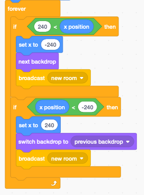

Rooms
=====

In some games the player can move to different rooms.

.. raw:: html
    
    <iframe src="https://scratch.mit.edu/projects/391583147/embed" 
    allowtransparency="true" width="485" height="402" frameborder="0" scrolling="no" allowfullscreen></iframe>

https://scratch.mit.edu/projects/391583147

The backdrops
-------------

For this project we use 4 backgrounds:

- one intro screen
- three different bedrooms

The player starts on the intro screen and can visit all three rooms.
Each room has it's own music and object.

When the stage starts, it sets the background volume level.

Switching rooms is done from the player. 
It's the player who decides to enter new rooms. 
In that case he sends a **new room** message.

When the stage recives the **new room** message, 
it stops the other stage scripts, which stops the current music.
It then sends a new message **play music**.

When the stage receveives the message **play music** 
it checks if the backdrop is the intro screen (1).
There is no music with the intro.

Otherwise it enters a **forever** loop to play the sound 
whos number corresponds to the current backdrop

The only way to interrupt this **forever** loop is to use the block
** stop othe scripts in sprite**.

The player
----------

The cat is the main character. 
It is moved via the arrow keys. 

When starting the program we set

- intro backdrop
- cat position, size and direction

The player can move left and write. 

Perspective view
----------------

The cat can also go deeper into the room.
Because it moves away from the viewer, we make it smaller.

Changing rooms
--------------

Whenever the cat reaches the left or right border, 
it enters a new room and reappears on the other side.

