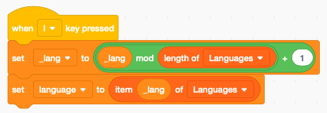

Scenario
========

Many Scratch projects involve story-telling such as:

- tutorials
- animations
- comics
- music videos

The common trait is a linear progression. There is a beginning and an end.
In this section we create a framework to easily order and manipulate

- dialog
- sprite movement
- background
- sound

The basic idea is to use a **script** or scenario. 
It is a list where each line describes what happenes at that moment of the story.

It contains the 

- dialog of all actors
- when and what they do
- where they are

.. raw:: html

    <iframe src="https://scratch.mit.edu/projects/399904114/embed"
    allowtransparency="true" width="485" height="402" frameborder="0" scrolling="no" allowfullscreen></iframe>

https://scratch.mit.edu/projects/399904114

The Script list
---------------

The main data structure of this program is the **Script** list.
It contains all lines of dialog.

In order to create the scenario, it is easiest to show the **Script** and
edit it by:

- ``+`` add a new item
- ``x`` delete the item
- (return) add new item

Pressing the **S** toggles the boolean **_script** variable and shows or hides the **Script** list.

Add a comment
-------------

The canvas contains a comment to give an overview of what the program can do
and how to use the program.

The progress bar
----------------

To indicate the progression, we will use a progress bar, like the one used in Youtube.

We call the costume **bar**, make it red like in Youtube, without an outline.
The important thing is to make it exactly the lenght of the screen (480 pixel) and 10 pixel high.

It must be placed so that the origin is exaclty in the center.

At start we set the size to 100% and the ghost effect to 50% transparency.

When the script **index** moves we update the porgress par. 
It covers the complete area of the screen.

The play/stop button
--------------------

Besides the progress bar, the play/stop button is the major user interface element.
When the program loads, it starts playing from the beginning.

We create a new Sprite called **Bar** which has two costumes:

- the **play** button
- the **stop** button

Both are centered and have the same size (38x51 pixels).

At start we

- place the sprite in the center
- set **_play** to 0
- broadcast **play** which will start playing

Pressing the space key toggles between play and stop.

Clicking the large, half-transparent play/stop button does the same.

The **_play** variable is a boolean variable which toggles between 0 and 1.
Adding 1 to it let's us set the costume.

- **_play=0**, stopped, show the play button (costume 1)
- **_play=1**, playing, show the stop button (costume 2)

If **_play=1** broadcast the message **speak**.

Each toggling of the play/stop button executes an animation:

- start small (size=50%) at the center
- grow larger and become transparent

If the index is on the last script position, we set the index to the first position.
This allows to restart from the beginning and not with the last script position.

Speak different languages
-------------------------

We are going to use Google translate and Text-to-Speech to display and speak the dialog in several languages.

The **Languages** list contains the 9 preconfigured lanugages.

At start we:

- set the voice to **squeak** (seems appropriate for Scratchy)
- set the language index **_lang=1** (English)
- go to line 1 (and start speaking)

.. image:: language_start.png

Pressing the **L** key cycles through the 9 preset languages.

Set the line
------------

To set the current line number we create the function **go to (i)**
It sets the current line to a number from 1 to lenght(Script).
The function 

- limits the **index** variable to the correct range using a **mod** expression
- sets the **line** variable to the **Script** item pointed  **index**
- translates the line to the current language
- broadcasts **update** to set the progress bar
- broadcasts **speak** to display and read out the line

Now we can use the arrow keys to increment the line (right)

or decrement the line (left)

Speak a line
------------

First we display the speech bubble. Then we speak the line, unless we are currently already speaking.

If **_play=1** then we:

- wait 0.5 seconds
- go to the next line (and read it)

Cut, copy, paste
----------------

To edit complete lines of the **Script** list we add the three standard functions:

- cut (x)
- copy (c)
- paste (v)

Cutting a line copies the current line first to the **tmp** variable and deletes the item.

Copying a line just copies the current line to the **tmp** variable.

Pasting a line inserts the **tmp** variable at the current **index** position.

Draw the mouth
--------------

To give the indication of speaking, we should animathe the mouth.
Duplicate three times the first cat sprite.

Now color the mouth of the first sprite with 70% red.

The cat sprite will look like this:

Now use the reshape tool to remove picture points.

Remove the edges of the mouth to get this.

The cat sprite will look like this.

Remove the mouth completely. Draw a new black line with a with of 2.4 points.
With the reshape tool click in the center and pull the line downwards until you get this:

.. image:: reshape3.png

The cat sprite will lok like this:

.. image:: mouth3.png

Animate the mouth
-----------------

To create the animation, we select randomly one of the 3 mouth sprites.
In between we wait 0.1 seconds. The loop repeats forever, and is stopped from the other script.

.. image:: Animate.png