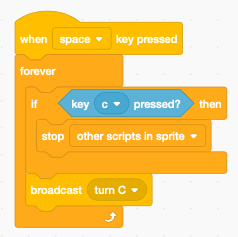

Scripts
=======

Stopping scripts
----------------

.. raw:: html
    
    <iframe src="https://scratch.mit.edu/projects/391832106/embed" 
    allowtransparency="true" width="485" height="402" frameborder="0" scrolling="no" allowfullscreen></iframe>

https://scratch.mit.edu/projects/391832106

This project has three sprites A, B and C.

When pressing the SPACE key, three forever loops are started which all rotate the letter.
All three loops are defined in the A sprite.

Pressing : 

- A - stops all scripts (A, B, C)
- B - stops the current script (B)
- C - stops the other scripts (A, B)

Scripts defined under the A sprite only can move or modify the A sprite. 
In order to modify the B or C sprite, they need to broadcast a message.

For a script defined under the A sprite, 
a message **turn B** needs to be broadcast to a script under the sprite B.

For a script defined under the A sprite, 
a message **turn C** needs to be broadcast to a script under the sprite C.

