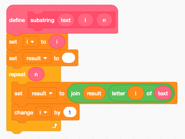

String
======

This section shows a couple of tricks to work with strings.
There are 4 operations with strings

- join(apple , banana) returns ``apple banana`` (there is a space after apple)
- letter(1, apple) returns ``a``
- length(apple) returns ``5``
- contains(apple, a) returns ``True``

Detect a key press
------------------

.. raw:: html

    <iframe src="https://scratch.mit.edu/projects/381350556/embed" 
    allowtransparency="true" width="485" height="402" frameborder="0" scrolling="no" allowfullscreen></iframe>

https://scratch.mit.edu/projects/381350556

Scratch can react to key presses. It can react to a specific key such as:

- space key
- arrow keys
- letter keys
- number keys

It also can react to *any* key, which includes: 

- symbols
- punctuation
- parenthesis

Unfortunately Scratch has no reporter block to tell you which key was pressed with the *any* option.
However it has the boolean function **key X pressed**.

To find out which key was pressed, we iterate inside a loop through the characters of interest.

Iterate through a string
------------------------

Our string functions will use two special variables to which we give short (one-letter) names:

- the index **i** pointing to a character inside a string
- the caracter **c** inside the string

We create the following function **iskey** which has two parameters

- the **characters** of interest
- the name of that **category**

The function shows the general alogrithm:

- set the index **i** to 1 (pointing to the first caractor of text)
- repeat for the length of the text
- set **c** to each consecutive letter of the text
- do something with the caracter **c**
- increment the index **i**

In the example below we detect: digits, punctuation, symbols and letters.

Our cat Scratchy annonunces the category and the key it recognizes. 
This method can be used to start a specific action when certain keys are pressed.

String comparison
-----------------

Scratch uses the ASCI code to compare characters.
Upper case letters (A..Z) are first transformed into lower-case letters (a..z).
There is no easy way to distinguish between upper-case and lower-case letters.

Repeat a string
---------------

The **repeat** function repeats a text n times.
Scratch functions do not allow a return value.
In order to return a result we define a variable which we call **result**.
The **split** function will requires two return strings, so we define these two variables.

The algorithm is quite simple:

- erase the **result** variable
- repeat and iterate **n** times
- join the text at the end of the result

Reverse a string
----------------

To reverse a string we extract letter by letter and assemble them backwards.

- erase the **result** variable
- set the index **i** to the first character
- repeat for the lenght of text
- join the i-th letter in front of the result
- increment index **i**

.. image:: reverse.png

Extract a sub-string
--------------------

To extract a substring from position **i** for a length **n** we:

- set the index **i** to the start character
- set the result to empty
- repeat **n** times
- copy a character to the result string
- increment index **i**

Split a string
--------------

The **split** function splits a text into 2 sub-strings at position **n**: 

- The frist n-1 letters are in **result**
- The remaining letters from n onwards are in **result2**

We use the function **substring** twice. 
Be careful to extract the second part first, as the **substring** function uses **result**.

Demo
----

.. raw:: html

    <iframe src="https://scratch.mit.edu/projects/390866776/embed" 
    allowtransparency="true" width="485" height="402" frameborder="0" scrolling="no" allowfullscreen></iframe>

https://scratch.mit.edu/projects/390866776

The following demo program shows the effect of the 5 string manipulation functions.

Imitate a typewriter
--------------------

Sometimes written conversation looks more natural if it is paced 
like the text appearing on a typewriter.

.. raw:: html

    <iframe src="https://scratch.mit.edu/projects/390908846/embed" 
    allowtransparency="true" width="485" height="402" frameborder="0" scrolling="no" allowfullscreen></iframe>

https://scratch.mit.edu/projects/390908846

The fonction **typewriter** has a text argument, and a second **ask** argument. 
If it is 1 the text is asked as a question, and the user is invited to give an answer.

.. image:: string3.png

The following text displays 3 phrases and asks a question. 
The answer is integrated into the 3rd phrase.

