Tablet
======

Many users will use Scratch applications on a tablet. 
Therefore we should take care in our program to make it work with a tablet.

Tablets do not have a keyboard so the only input is the pointer.

.. raw:: html

    <iframe src="https://scratch.mit.edu/projects/396114914/embed"
     allowtransparency="true" width="485" height="402" frameborder="0" scrolling="no" allowfullscreen></iframe>

https://scratch.mit.edu/projects/396114914

Introduction
------------

We are going to develop a short, tutorial-type program.
This program has 10 slides. Each slide has a title and most of the slides have icons.
Scratchy is the narrator and displays the text. 
At the bottom there is 5-button navigation menu.

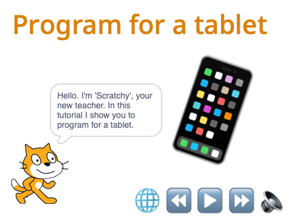

Dialog
------

There is one line of dialog per slide and it is kept in the list **Dialog**.

These are the 10 lines of text (or dialog).

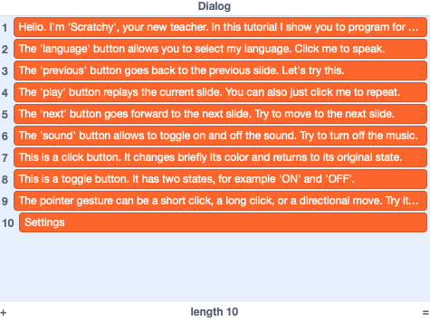

Languages
---------

In our program you can choose among 16 different languages. 
These languages are kept in the list **Languages**.

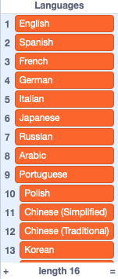

Backdrops
---------

The backdrops are all vector images. 
This allows to easily change the titles.
It also gives perfect resolution in full-screen mode.
The smartphone image below is an emoji. 
That is a very useflul method for getting high-resolution icons.

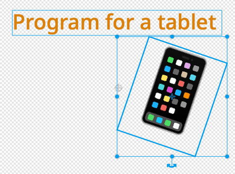

The stage
---------

At the start we:

- switch to the title slide (intro)
- hide the Dialog list
- broadcast **show** (this hides all sprites which are not visible on this slide)
- set the volume for the background music to a low value (15%)
- enter the forever loop to play the background music

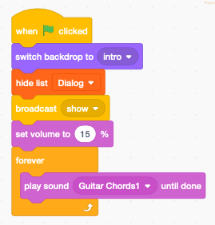

Only the stage receives the **when stage clicked** event.
The sprites only have access to their own **when sprite clicked** event.

When the stage is clicked (outside of a sprite), the message **gesture** is broadcast.
It will be dealt with in the code of the **Gesture** sprite.

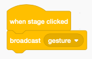

The next function is a helper function to show the dialog. 
It is only used during development. Scratch can display at the maximum 13 lines of a list.
Typically the backdrop editor is open, and you add a line of text for each backdrop,
taking care to keep the same numbering.

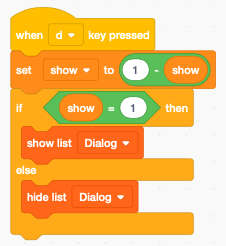

Only the stage can change the volume of its background music.
The broadcast message number **5** is used to toggle the music. 
This corresponds to the button number 5.

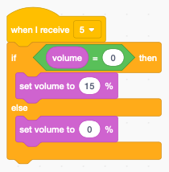

Scratchy the narrator
---------------------

Scratchy is our narrator. 
The speech bubbles are the only way to display text under program control.

When the sprite Scratchy receives a **speak line** broadcast it:

- takes the line of dialog which correspond to the current backdrop number
- translates this to the chosen target language
- displays (say) the dialog in a speech bubble
- broadcast **talking** (to start moving the mouth)
- speak the dialog in the selected language
- stop the **talking** script
- close the mouth at the end of the dialog

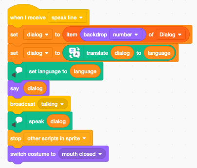

The mouse movement needs to be done in a separate loop.

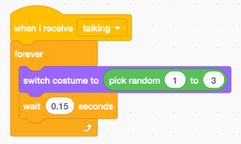

The icon menu
-------------

Sprites are clickable.
It would be possible to have a separate sprite for each menu button.
Here we use a different approach. 
We have one single sprite which is made up of a string with 5 emoji characters.

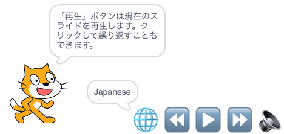

We each ajust the size of the string to 250 pixels, 
so that each emoji has a width of 50 pixels.
The origin is also important. 
The origin marker is placed in the upper left corner.

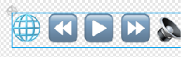

At the start of the progam we

- set the language to English
- place the sprites
- display *English* in the speech bubble

Displaying the language next to the globe, makes its meaning clearer to the user.

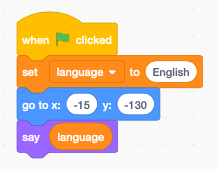

When this sprite is clicked, we

- calculate the mouse position from the x-origin of the sprite
- divide by the button width (50)
- round up (ceiling)

This will give us a number from 1 to 5 which corresponds to the button clicked.
We broadcast directly this number.

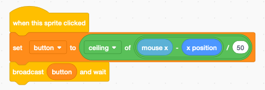

Button 1 (globe) increments the language index.
We have to keep the index (language_i) in a variable.

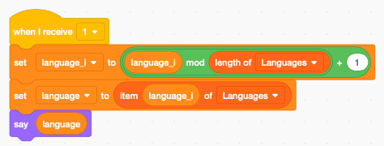

Button 2, 3 and 4 are navigation buttons.

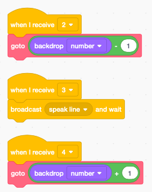

This is the function to go to a new slide

- switch the backdrop
- show/hide the sprites
- speak the new line of dialog

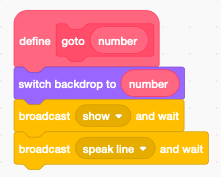

The last 3 scripts are a convenience when using a keyboard:

- left arrow : previous slide
- space key : replay current
- right arrow : next slide

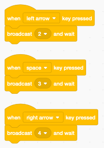

A click button
--------------

This example button is only shown in slide 7 and 8.
In slide 7 it works as a click button. It:

- switches to the second costume (orange)
- waits 0.2 seconds (a brief flash)
- switches back to the first costume (blue)
- it prononces *clicked*

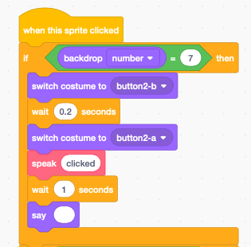

A toggle button
---------------

In slide 8 the same button behaves as a toggle button with two states.
It toggles between costume 1 and 2. The costume number is used as the state variable.

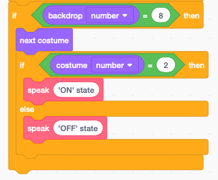

The function **speak** pronounces the *text* argument in the selected language.
To make it different from Scratchy we set the voice to *tenor*.

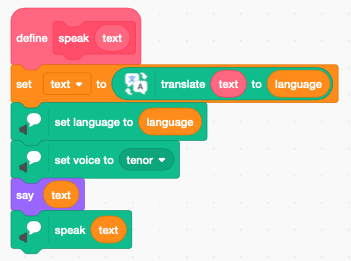

Finally the **show** broadcast, hides the speach bubble, and then shows the button
sprite only if we are in background number 7 or 8.

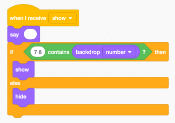

Pointer gestures
----------------

On tablets, Scratch does not provide a soft-keyboard.
To use one, we would need to program it in Scratch.
However mouse clicks and gestures are the natural way of interacting with a tablet.

To give the user some feedback, we visulize the result of the gesture.
On the following image we see three simple clicks. 
An explanation of the gesture is visible for 1 second.

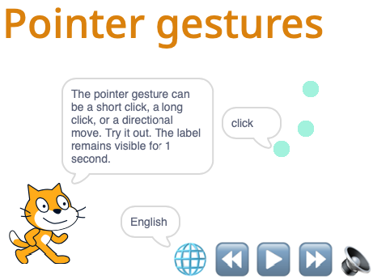

If we press longer than 0.3 seconds, the click is detected as a **long click**.
In the image below we have 3 normal clicks and one long click.

.. image:: tablet_gesture2.png

This is a gesture towards the right. It can be used to go to the next page.

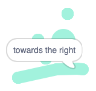

This is a gesture towards the bottom.

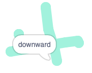

The gesture algorithm
---------------------

At the start we record the initial mouse position (x, y) and the time t.
The the **Gesture** sprite goes for 5 frames to the mouse position with the pen down.

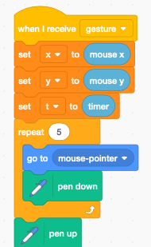

At the end of the gesture, we calculate the displacement vector (dx, dy).
If the displacement vector is zero, we have a click.
We then wait until the mouse is up and look at the elapsed time.

If it's more than 0.3 secondes we have a long click and we draw a bigger circle, 
to make it visually clear to the user.

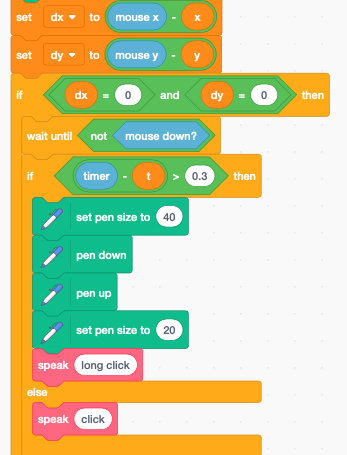

If the displacement value is not zero, we determine in which direction it is.
The line dx=dy is the diagonal which goes up from left to right.
The line dx=-dy is the diagonal which goes down from left to right.

Using these conditions, we obtain the 4 cases

- towards the left
- towards the right
- upwards
- downwards

Because of the automatic translation we make the words in English as specific as possible. 
That is the reason of not just using left/right or up/down.

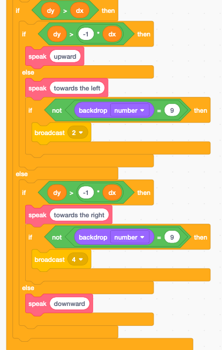

We want to use text as a means of feedback for gestures on all 10 slides.
However the speaking voice, we only want it in slide number 9, where we present gestures.

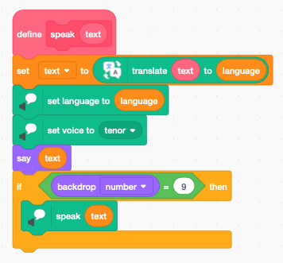

