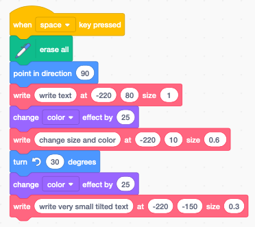

Text
====

Scratch cannot place arbitrary text onto the stage.
Normally it can only

- handle predefined sprites
- produce arbitrary pen drawings

Display text
------------

For displaying text in a Scratch app you can use:

- the speech bubbles
- the variable display
- the list display

What we are developping in this section, is to define a special sprite 
which has as costumes the symbols of an alphabet (letters, digits, punctuation).
Then we use these **Letter** sprite to create text.

By using sprites as letters, our text can have any kind of 

- position
- size
- color 
- angle

If the text is static we can use **stamps**. If the text needs to be dynamic we use **clones**.

Define the letters
------------------

The first thing is to define a **Letter** sprite.
We do it only for the 26 lower-case letters, but we could include upper-case letters, 
digits, punctuation and other special characters.

This is the letter **a**. It is a vector drawing with the letter a. 
Care has been taken to create a letter with a hight of exactly 101 points.

The origin of the sprite needs to be placed in the lower left corner of the letter box.
This is best done at the highest zoom level.

Now we can duplicate this costume 25 times.
Then we replace all the letters with the remaining letters of the alphabet.
At the end we rename all the sprites so that their names match with their letters.
Here are the first three letters.

We notice that all three boxes have a hight of 101 points, but the width varies from 
46, to 49, to 36 points.

This is very close to the values which will be 
calculated in the next section and stored in a list called **Width**.

Calculate the letter width
--------------------------

Scratch has no function to return the width of a sprite. 
The only way of measuring the size of a sprite is to move it pixel by pixel 
until it touches one of the four edges.

We create a **Width** list for the 26 values of the letter width.
At the start we

- reset the letter to horizontal (90°)
- switch to the first costume (letter a)
- set its size to 100%
- clear any graphic effets
- delete all items of the list
- enter a loop to get the width for each letter

Since all costumes have the origin at the lower left corner, 
detecting the intersection with the right edge is all we need.

The function works as follows: 
    - place the letter at x=120.
    - advance pixel by pixel until the rigth side touches the edge 
    - width **w = 240 - x**

Write a text
------------

We can now define a function to assemble the letters of a text.
The function

- sets the sprite size
- resets the index **i**
- enters a loop for each letter of the text

Inside the loop we

- switch the costume to current character
- get its width from the **Width** list
- if the character is a space, we advance 20 steps
- otherwise we advance for the width of the letter

The previous function draws text based current sprite's

- position
- direction
- color
- transparency

For convenience we define a second **write** function which includes position.

Now we can define our demo, started by pressing the space key.

