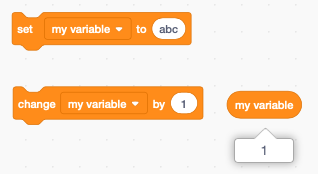
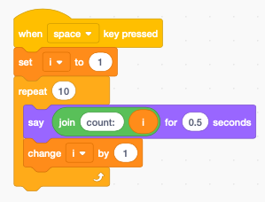

Variables
=========

Variables are places in the memory of the computer to store values. 
You can store numbers and strings. 

Blocks
------

In a new project there exists already one global variable called **my variable**. 
You can use it, rename it or delete it.

When you activate the checkmark, the variable is displayed on the stage.

Set variable to
---------------

You can set a variable to a number value or to a string value. 
The following command will set the variable to the number value of 99.

To check the value of the variable you can drag a **reporter** block 
onto the programming canvas and click on it.
The current value of the variable is displayed.

Change variable by
------------------

The **change by** block adds a number to the existing value.
For example if the variable has been set to 99 and the **change by 1** 
block is executed, then the new value of the variable will be **99 + 1 = 100**.

If the variable contains a string value (such as *abc*), and you try to increment it, 
it's value will be considered to be zero. 
After the change the variable has the value of the increment such as **0 + 1 = 1**.

Display a variable
------------------

There are three ways to display a variable:

- normal readout, which has a label next to it
- large readout, without a label
- slider, the only way to modify the variable (works also on tablets)

When you select **slider** there is an option to select the minimum and maximum value.

When a variable is displayed on the stage, 
you drag it with the mouse to the desired position.

However there is no way to do this with code.

Create a new variable
---------------------

When clicking on the **Make a Variable** button you can create a new variable.
In the example below we give it the name **x**.

You must also choose if this variable

- is available for all sprites,
- is available only this sprite.

You also can make it a **Cloud variable** which will be stored on the server.
This feature requires to be logged-in.. It allows to create multi-player games.

Rename or delete
----------------

All variable drop-down menus allow you to rename or delete them.
You could delete or rename the **my variable**. 

Global and local variables
--------------------------

When a variable is created for a single sprite only, it is called a **local** variable.
Two local variables can have the same name.
Variables which are available to all sprites are called **global**.

In the example below we have 3 variables: 

- a global variable **y**
- a local variable **x** for the sprite **Scratchy** and
- a local variable **x**  for the sprite **Cake**.

Stage variables are global and are available to all sprites.

Several **reporter** values can be displayed on the stage.
Colors are used to distinguish them.

- orange for user-created global and local variables
- blue for sprite position and direction
- violet for sprite size
- purple for sound volume
- turquoise for global information such as the timer

Your program can only show and hide the user-created variables (orange).
The visibility of the other reporter variables can not be programmed.

Variable as a counter
---------------------

A typical use of a variable is to be used in a loop as a counter.
In that case we use the variable **i**. This stands for 

- integer, or 
- index

A counter loop consists of these blocks:

- set **i** to the initial value (often 1)
- enter a repeat loop
- do something with variable **i**
- change **i** by an increment (often 1)

The above code makes Scratchy count from 1 to 10.

Largest number
--------------

The numbers which can be stored in variables are floating point numbers. 
They are called **double-precision foating point numbers** and are encoded internally with 64 bits.
It has about 15 significant digits.

The largest number which can be represented is close to **1.8e308**. 

This value can still be used:

.. image:: var_intmax.png

This slighty larger value results in **Infinity**.

Make a list
-----------

Besides variables Scratch has a second way of storing information : lists.
Lists are groups of variables. 

After making a new list you can display it on the stage.

This is the easiest way to enter data

- click (+) to create a new item
- click and drag (-) to resize the list
- when editing press ENTER to create a new item

The following image shows a list called **Dialog** with 3 items.

The image above shows index **i = 2** accessing the item *I'm Scratchy*.

Cycle through a list
--------------------

A frequent task is to cycle through all the elements of a list. 
Like in the counter example from before, we are using an index variable **i**.

The steps are

- initialize the index **i** to 1 (first item)
- repeat for the lenght of the list
- do something with the item number **i**
- change **i** by 1

