Bricks
======

The following game uses a paddle to bounce a moving ball. The ball must hit a wall of bricks. 
When the ball hits a brick, the brick is destroyed. 
When all the bricks are destroyed, you win the game.

.. raw:: html

    <iframe src="https://scratch.mit.edu/projects/393952500/embed" 
    allowtransparency="true" width="485" height="402" frameborder="0" scrolling="no" allowfullscreen></iframe>

https://scratch.mit.edu/projects/393952500

Sprites
-------

This game uses 4 sprites:

- ball
- paddle
- brick
- text (you win, game over)

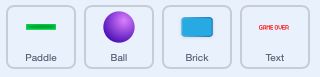

Paddle
------

In this game we don't need Scratchie the cat. Delete it and load the **Paddle** sprite.
We use a very simple script to move the paddle with the mouse.

We set the x coordinate to the **mousex** coordinate 
and the y coordinate to a fixed value at -150.

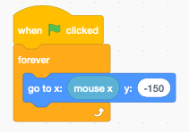

Ball
----

Add a new sprite **Ball** sprite.

When the program starts:

- set ball size to 80%
- switch to costume **ball-e** (violet)
- go to the center position (0, 0)
- point to left and down (135 degrees)
- wait 1 second until the bricks are placed
- enter the **forever** loop
- move 10 steps and bounce from edges

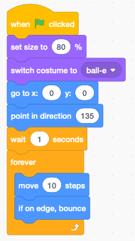

When the ball receveives the message **bounce** it changes direction.

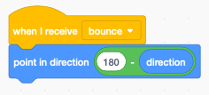

There are two events which make the ball bounce;  when it hits

- the paddle, or
- a brick

Bricks
------

You can load the **Button3** sprite and delete the gray costume.
When the program starts we:

- set the size to 50%
- hide the original brick
- set the score to 0
- place the original brick sprite to position (-200, 140)
- enter a 4x9 nexted loop
- clone the brick 36 times
- 9 columns spaced by 50 pixels
- 4 rows spaced 30 pixels

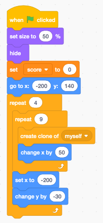

Whenever a clone starts we:

- show the sprite
- enter a **forever** loop

if a brick is touched by the ball
- the message **bounce** is broadcast (to the ball)
- the socre increases
- the brick is removed

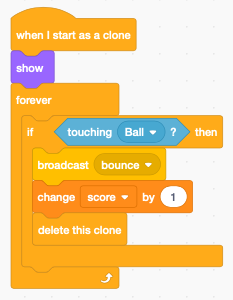

Text
----

Create a **Text** sprite with two messages:

- you win (green)
- game over (red)

Be careful to center both texts.

When the program starts:

- go to the center (0, 0)
- hide the text
- wait until the sore is 36
- switch to **you win**
- show the sprite
- stop all scripts

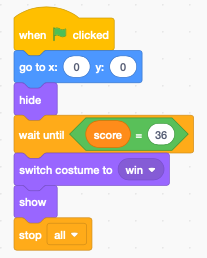

When the message **gameover** is received, then 

- show the costume **game over**
- show the sprite
- stop all scripts

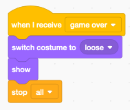

Polish the game
---------------

Now that we have a functional game, let's polish the game.

.. raw:: html

    <iframe src="https://scratch.mit.edu/projects/393997612/embed"
     allowtransparency="true" width="485" height="402" frameborder="0" scrolling="no" allowfullscreen></iframe>

https://scratch.mit.edu/projects/393997612

Add a background
----------------

Add a backdrop to your game. Here we choose the **Neon Tunnel** backdrop.

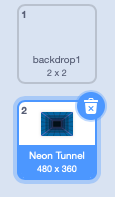

Add music
---------

Inside the Stage, we add the **Video Game 1** sound.
This little script plays it in a loop.

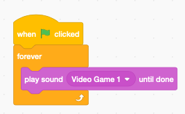

Make the paddle flash
---------------------

When the ball hits the paddle, we make it flash by changing the color effect for 0.2 seoconds
and then go back to the original color.

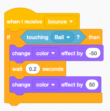

Animate the brick entry
-----------------------

To make the brick entry more interesting, we can animate them.

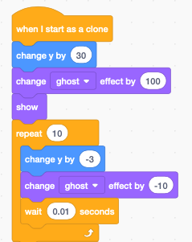

Animate the brick exit
----------------------

Inside the brick clone loop we add the following code:

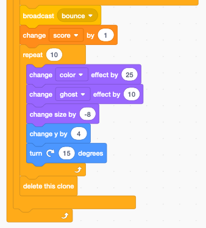

Add sound effect to brick
-------------------------

We add two sounds (Laser1 and Laser2) to the brick sprite.
When the ball touches a brick, we chose one of the sounds randomly.

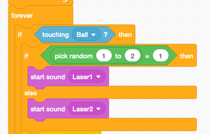

Add a trail to the ball
-----------------------

We use cloning to add a trail to the moving ball. 
First we change the color of the clone to the green costume (ball-d).

Each ball clone goes through 20 iterations and 
becomes smaller and more transparent (ghost effect).
After 20 iterations the clone is deleted.

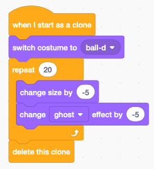

To control the timing of the clone trail, we use a second **forever** loop 
in the ball sprite. It creates a new ball clone and every 0.1 seconds.

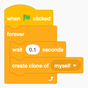

Animate Game Over sprite
------------------------

Let's animate the game-over sprite: 

- add a **Gong** sound
- make the sprite rotate
- wait 3 seconds to let the music play

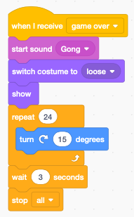

Animate You Win sprite
----------------------

When the score reaches 36, we

- add a **Tada** sound
- repeat 10 times
- increase the sprite size by 5 %
- wait 3 seconds to let the music play

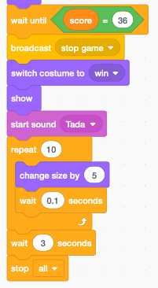