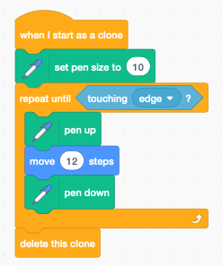

Clones
======

A **clone** is an exact copy of a sprite which inherits also all the scripts. 
This is useful if you want to create multiple spirits which have similar behavior.

There are 3 clone-related blocks:

- a hat block to start as a clone
- a stack block to clone the current sprite
- an end block to delete the clone (and stops its scripts)

If a variable is marked as *for this sprite only*, 
each clone will have its own private variable,
just as each clone has its:

- position
- direction
- pen

Decaying sprite trail
---------------------

.. raw:: html

    <iframe src="https://scratch.mit.edu/projects/390996965/embed" 
    allowtransparency="true" width="485" height="402" frameborder="0" scrolling="no" allowfullscreen></iframe>

https://scratch.mit.edu/projects/390996965

You can use clones to create a mouse trail. 
Usually these clones will fade out and disappear. 
For exemple they can decrease their size, or use the ghost effect to become invisible.

At start the sprite is initialized with an initial: 

- position
- direction
- size

Inside the **forever** loop the sprite is rotated by 30 degrees and advanced. 
It executes a circle. At each of the 12 positions a clone is created every 0.3 seconds.

Every 0.4 seconds the clone size decreases by 10%. 
After 10 iterations the clone is deleted.

Pen trail towards the edge
--------------------------

.. raw:: html

    <iframe src="https://scratch.mit.edu/projects/391011669/embed" 
    allowtransparency="true" width="485" height="402" frameborder="0" scrolling="no" allowfullscreen></iframe>

https://scratch.mit.edu/projects/391011669

This project creates clones at random positions and random directions.

Each clone continues to move forward in its chosen direction.
When it reaches the edge, the clone is deleted.

Pressing the space bar erases the stage.

Disappearing balloons
---------------------

.. raw:: html

    <iframe src="https://scratch.mit.edu/projects/391035000/embed" 
    allowtransparency="true" width="485" height="402" frameborder="0" scrolling="no" allowfullscreen></iframe>

https://scratch.mit.edu/projects/391035000

An image with a large portion of a sky had been chosen.
The ballons appear at random positions at the bottom of the image.

First we hide the orginal sprite, then we enter a **forever** loop and:

- go to a random location
- switch the costume to a different color
- create a clone
- wait 0.5 seconds

Each cloned balloon moves upwards into the sky.
At each iteration it gets smaller, until it disappears.
To make the movement look more natural, a small random change is introduced into the direction.

Particle effects
----------------

Clones can be used for special effects such as:

- fire, sparks, explosions
- fog, clouds
- bubbles,
- birds, fish, leaves

.. raw:: html

    <iframe src="https://scratch.mit.edu/projects/391003021/embed" 
    allowtransparency="true" width="485" height="402" frameborder="0" scrolling="no" allowfullscreen></iframe>

https://scratch.mit.edu/projects/391003021

For each clone we define 3 individual variables:

- the x displacement **dx**
- the y displacement **dy**
- a boolean variable **is_original** to indicate if the sprite is the original or a clone  

At the start of the program there is only the parent sprite.

- set **is_orignal** to 1 (it's not a clone)
- hide the parent sprite
- create a spark effect at position (1, 1)
- enter a **forever** loop
- create sparks at the mouse position when the mouse is down

The function **effect at (x, y)** does the following:

- go to position (x, y)
- check if the sprite is an original (is_original = 1)
- repeat 10 times
- wait 0.05 seconds and create 3 clones

When a clone starts it does

- show the sprite
- set **is_original** to 0 (it's a clone)
- set a random speed (dx, dy)
- add a random color variation
- repeat 20 times
- become more transparent (add 4% ghost effect)
- change position by (dx, dy)
- add gravity to **dy**
- delete the clone after 20 iterations

