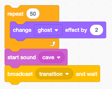

Adventure game
==============

In this section we are going to program an adventure game.  
The game has a main character who narrates the story (**Boy**). 
At certain points the player must solve a puzzle to advance in the story. 

There is a secondary character (**Girl**) in the story. 

A Scratch program can easily get very complicated if the code is spread over several sprites. 
To make the program understandable, you can either 

- place the story line into the stage (backdrops), or
- use a main character to narrate the story

Here we choose a main charactor to narrate the story.

Backdrops
---------

To organize the story, we place all the backdrops in the order of appearance:

- title
- loft
- chamber
- museum

Since the story is driven by the main sprite (**Boy**), there is almost no code here.
The only code is a slow transition from the current backdrop to the next one.
For this to work, the backdrops need to be in the correct order.

The intro screen shows the title and two buttons:

- select language
- start the game

Sprites
-------

In this game we have 7 sprites: 

- the actors: **Boy** and **Girl**
- the objects: **Objects**, **Code**, **Pencil**
- the interface objects: **Continue**, **Menu**

The menu
--------

In this game we have a simple menu with two buttons.
We have used emoticons to create them. This is an easy way to create them. 
They are universally understood, and it's easy to add more buttons.

Pay attention to these things:

- make the height of each icon 40 points (in this case the total height is 80 points)
- add an extra space after the first icon (to avoid cropping icons in Android, which has larger icons than iOS)
- place the origin at the lower left cornder

At start we place the icons and set the language to the first language (English).

The languages of the game are kept in a list.
We use the variable **_lang** as an index.

When the sprite is clicked, we use the **mouse y** position to calculate the index of the button.

If the **language** icon is clicked, we iterate to the next language in the language list.
The selected language is displayed for 5 seconds.

If the **start** icon is clicked, we make the make the buttons almost transparent and start the game.
We keep the buttons in a very transpartent state on purpose, in order to change the languge or restart during the game.

The narrator
------------

At the start of the game, we:

- display the title screen
- set the boy's voice to squeak
- hide the boy

Choose a secret message
-----------------------

When receiveing the **start** message the game starts. 
We start by choosing a random secret message.

The **Message** list contains 5 possible messages.

Overlapping sounds
------------------

The story starts with an empty loft. Sounds prepare the entry of the main character.

These two sounds are used:

- door creak (4.9 seconds)
- foot steps (5.3 seconds)

To create an atmosphere sounds often overlap.

We start the second sound after 4 secondes. 
That gives us 0.9 seconds where the door and the foot-steps overlap.

After the second sound we wait 3 secondes. 
Then the main character appears. During 2.3 seconds, the footstep sound overlaps with the character movement.

Walking up the stairs
---------------------

To create the illusion that the boy is walking up the stairs, we make him 
move by (-20, -20) points and stop for 0.3 seconds.

The first 9 costumes are a walking sequence.
We repeat these costumes and move the charactor to the right.

Look, sound and speech
----------------------

We accompany phrases with gesture (laugh, point up).
Sounds are interspersed in between phrases.
The **suspense** is played to the end, before the conversation continues.

Interact with objects
---------------------

The objects (Theophilus' portrait, knob, ring) are in a different sprite. 
The only way to interact with these objects is to send messages.
We send the message 

- **show theophile** to make the portrait appear,
- **color effect** to add a color animation.

Transition
----------

The next seend is often anticipated with sound.
Here we start the scene transition with the **cave** sound have a 

- fade-out of the loft (2 seconds)
- fade-in of the chamber (2 seconds)

Walk backwards
--------------

We use the 9 costumes of the walking sequence again, with a -5 point displacement, to simulate backward walking.

Parallel actions
----------------

Parallel actions need to run in a separate stack.
Here we want the boy to scratch his head, while he is listening to the explanation of the code chart.

- The broadcast **scratching** starts the parallel action.
- In parallel, the new code sprite appears and a variable-length explanation follows.
- The scratching is stopped when the *explain* action returns, by using the **stop other scripts in sprite** block.

The scratch animation is done with only 2 costumes.
Since the duration is variable, a **forever** loop is used.
The loop is forcefully stopped with a **stop other scripts** block.

Ask for secret message
----------------------

This code asks the user to decipher the secret message.
The program only can advance if the message is correctly found.

The **ask** function asks the question. It:

- translates the text
- writes it to the speech bubble
- prononces it
- displays it again and opens the **ask** dialog.

Scene transition
----------------

Let's look at the scene transition technique used:

Being at the end of the *chamber scene*: 

- the character talks about the next scene (I know the old tree)
- the character hides
- bird sounds start
- the chamber fades out
- the tree fades in
- the character is positioned
- the character appears in the new place
- The character talks about the new scene (I was here before)

Talk between characters
-----------------------

In the *museum scene* we have a dialog between the boy and the girl.
Speech bubbles only can be called in the code that belongs to that sprite.

We use the message **speak** to call code belonging to the **Girl** sprite.
The variable **line** contains the text to be spoken.

This is a talking scene in the museum, in Japanese.

The girl sprite
---------------

The code of **Girl** sprite is very short.
The girl only appears in the *museum scene* and does not move around.

At the start the girl is placed, facing to the left, and hidden.

When it receives the **speak** broadcast, it

- displays the **line** in a speech bubble
- pronounces it in the chosen language
- broadcasts the **continue** message (space or click)

The sprite only appears in the museum scene. 
In the last scene the sprite is hidden.

Interact with objects
---------------------

The **Obejects** sprite contains costumes of different objects

- Theophilus
- knob
- ring

.. image:: object.png

These objects are not animated and appear not simultaneously.

At the start all objects are hidded.
Upon reception of ** show Theodophilus** the sprite blows up from 0% in size to 60%.

The message **color effect** triggers a color effect

The knob of the drawer appears with a ghost effect of 80%.
When the mouse comes near, the ghost effect changes and the knob becomes more solid.

The cipher
----------

The **Pencil** sprite translates the text in the **message** variable to a written code.

The pigpen cipher or masonic cipher exchanges letters for geometric symbols.
The first 2x9 letters are arranged in a tic-tac-toe shape.
The following 2x4 letters of the alphabet are arranged in an x shape.
The surround pattern is forms the secret symbol. The second group is designated with an added dot.

For example the message *the oak tree keeps my ring* is expressed as this:

Play the game
-------------

This is the game:

.. raw:: html

    <iframe src="https://scratch.mit.edu/projects/402279634/embed"
    allowtransparency="true" width="485" height="402" frameborder="0" scrolling="no" allowfullscreen></iframe>

https://scratch.mit.edu/projects/402279634

