Codes
=====

In this chapter we look at how to display different codes. We are looking at

- 16 segment displays
- Pigpen code
- Braille code
- Morse code

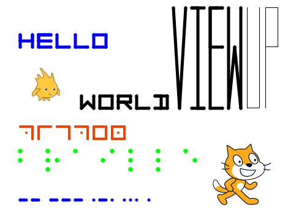

https://scratch.mit.edu/projects/404785655

16-segment code
---------------

A sixteen-segment dispaly is a type of diasplay based on 16 segments which can individually be turned on and off.
A 16-bit binary code encodes and represents all possbile characters.

For example the letter O could be represented with this 16-bit code::

    1110001001000111

The segments are in the order from left to right, and top to down.

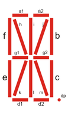

The following image shows how letters, numbers and special symbols can be represented.

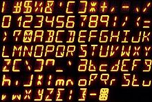

Scratch cannot draw characters to the screen. There are two ways to print text in scratch:

- use a sprite for each letter
- draw the letter with the pen

Encoding the symbols
--------------------

When drawing each letter with the pen, we need to encode somehow the geometric shape of the letter.
We are going to use a system inspired by the 16 segment display. 
We use the 3x3 points of intersection and encode the number with a path going through these points.

The points are numbered like this::

    6 7 8
    3 4 5
    0 1 2

To store the information about how to draw the symbbols or caracters, we will use 2 lists:

- symbols
- patterns

The function **add** associations a symbol with a pattern and adds them to the two lists.

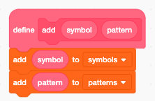

The first letters from *a* to *h* are encoded this way.

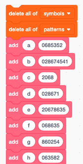

This shows all the characters which have been encoded.
More characters could easily be added if needed.

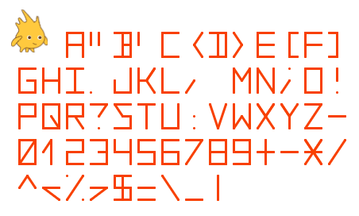

Draw a character
----------------

When drawing a specific symbol, we must first retrieve its code. 
This is done with the **find in list** block, which returns the index **i** of the pattern.
In a second step we can look up the pattern associated with the symbol.

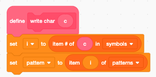

We iterate through the sequence of points. The point index **p** starts from zero at the bottom left and goes from left to right.

We can use the two formulas to get the x and y offsets from the point index **p** (0 to 8):

- x + mod(p, 3) * w
- y * floor(p/3) * h

The index 9 is used to lift up the pen, if we want to draw two disconnected lines.

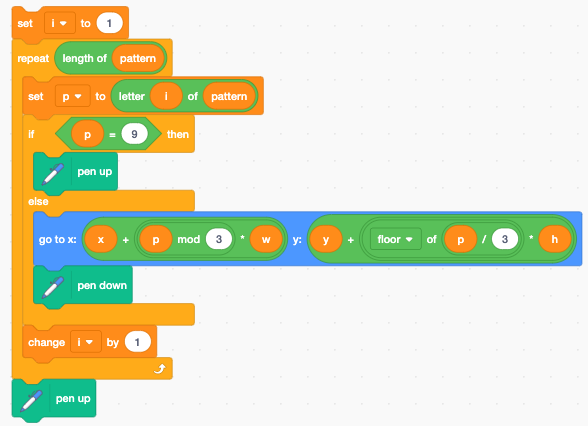

Draw a text
-----------

We used the index **i** to iterate inside the character function.
To avoid interference we must use a different variable **i** in the **write text** function.

We write each new character next to the previous one. If the right margin (x2) is reached, 
the current character position is reset to the left margin (x1), and the y position is advancen to the next line.

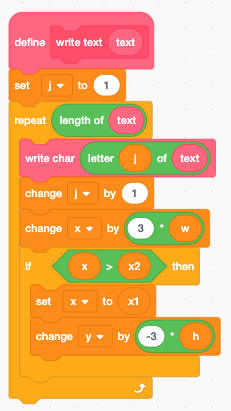

Settings (local variables)
--------------------------

A number of settings are encoded as local variables.

- the left and right margin (x1, x2)
- the current character position (x, y)
- the half-width and half-height (w, h)
- the pen thickness
- the pen color

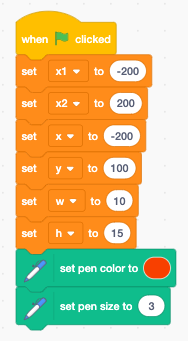

Parsing a command string
------------------------

In order to change these parameters from another sprite, we will use a command string.
The format of the command string is very simple: key=value.
For example to set the left and write margins we would write::

    x1=-100 x2=150

To set size::

    s=5

The **parse** function takes the *limit** character set as an argument.
The index **i** must point to the first character to analyze. 

The **parse** function extracts the next token, which is separated by **=** or space ( ).

- **c** returns the limit character
- **p** returns the found token

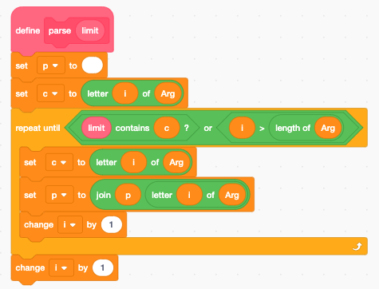

Pigpen cipher
-------------

The pigpen cipher or masonic cipher is a geometric, simple substitution code.
We can easily program it using the 3x3 matrix and a dot.

.. image:: pigpen_cipher.png

Braille code
------------

The Braille code is a code used by blind people by using the sense of touch.
It consist of a pattern of 6 raised dots. 
It is one of the first binary codes. Braille code pattern can be represented with a 6-bit binary code.

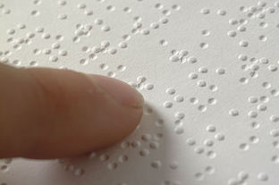

Morse code
----------

.. image:: morse_code.png
